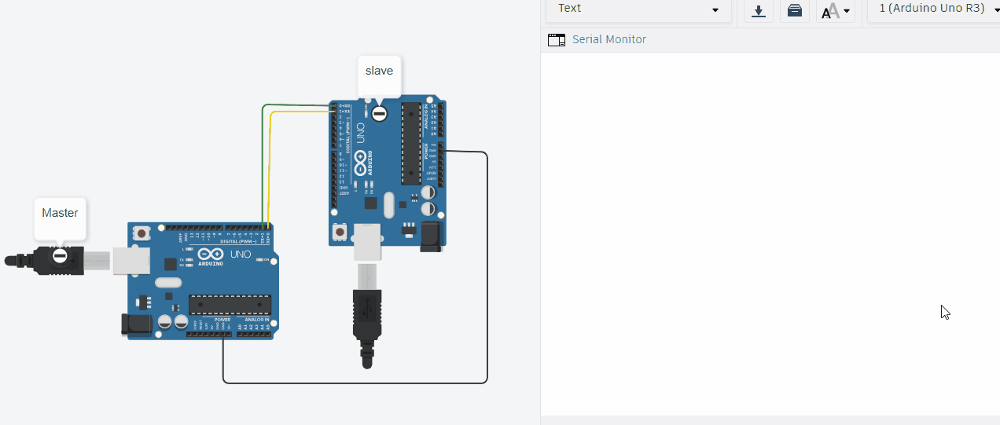
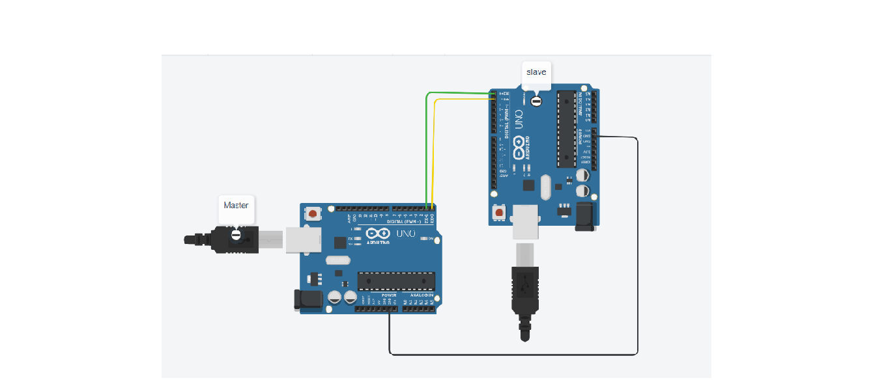

# Tinkercad Serial UART Communication

Project: Master-Slave UART Hello World

### **Demo**

Description: This setup shows how two Arduinos can talk to each other using Serial UART.

Working: The Master board transmits "Hello world" through its TX pin every second.
The Slave board reads the incoming serial data and displays "Hello world" on the Serial Monitor.

Use: Basic example for learning Arduino-to-Arduino communication for sensor networks, 
robotics, and data transfer projects.

### **Cicruit diagram

